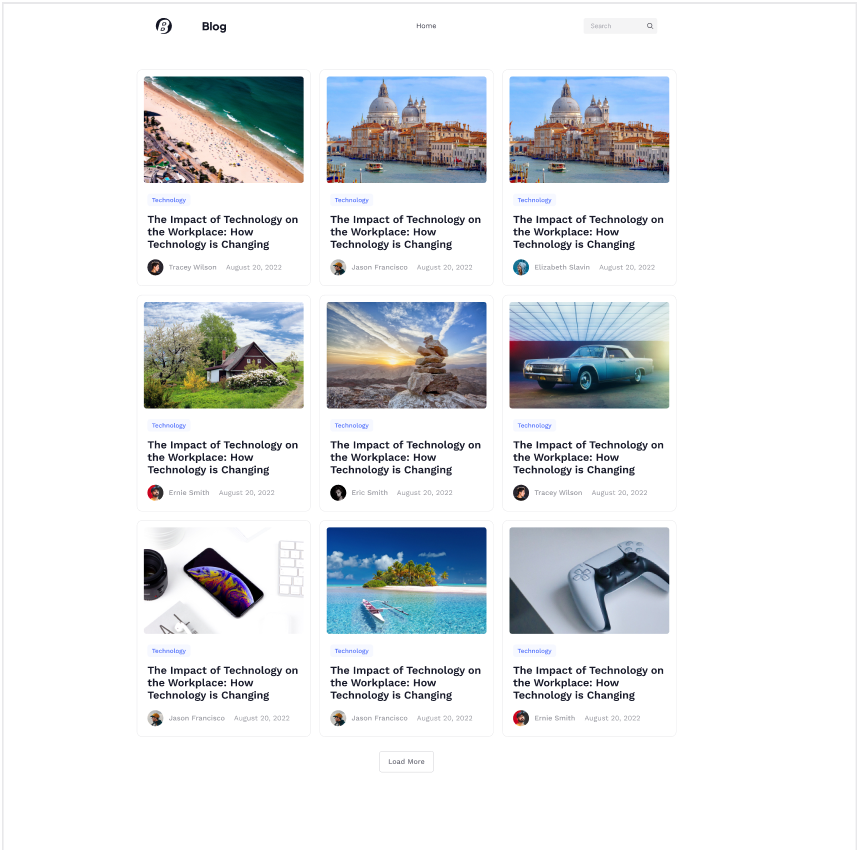

# Blog

  

This project showcases my skills in web development and design. It is a platform that provides users with access to a wide range of articles from various categories. The application is built using React, Vite, Tailwind CSS, Material-UI, and custom hooks, delivering a seamless and responsive experience.

## [🌟Live Website🌟](https://blog-kappa-seven-96.vercel.app//)

##  [ Design on Figma ](https://www.figma.com/file/Pz9qMF1LLYVwvrbCRixGv1/Almdrasa-blog-ui?type=design&node-id=1-2&mode=design&t=q1hE1xSiE6pNRrDP-0)

## Screenshots
  

  
## Table of Contents

- [Features](#features)
- [Technologies Used](#technologies-used)
- [Contact](#contact)

## Features

- **Search Bar**: Users can easily search for articles by keywords.
- **Load More Articles**: Infinite scrolling functionality allows users to load more articles dynamically.
- **Responsive Design**: The application is fully responsive, ensuring optimal user experience across various devices.

## Technologies Used

- **React**: JavaScript library for building user interfaces.
- **Vite**: Fast, modern build tooling for frontend development.
- **Tailwind CSS**: Utility-first CSS framework for rapid UI development.
- **Material-UI**: React components for faster and easier web development.
- **Custom Hooks**: Utilized custom React hooks for managing state and logic efficiently.

## Contact

- [Author](https://github.com/MMansy19)
- [Website](https://mahmoud-mansy-portfolio.netlify.app/)
- [Email](mailto:mahmoud2abdalfattah@gmail.com)
- [LinkedIn](https://www.linkedin.com/in/mahmoud-mansy-a189a5232)
